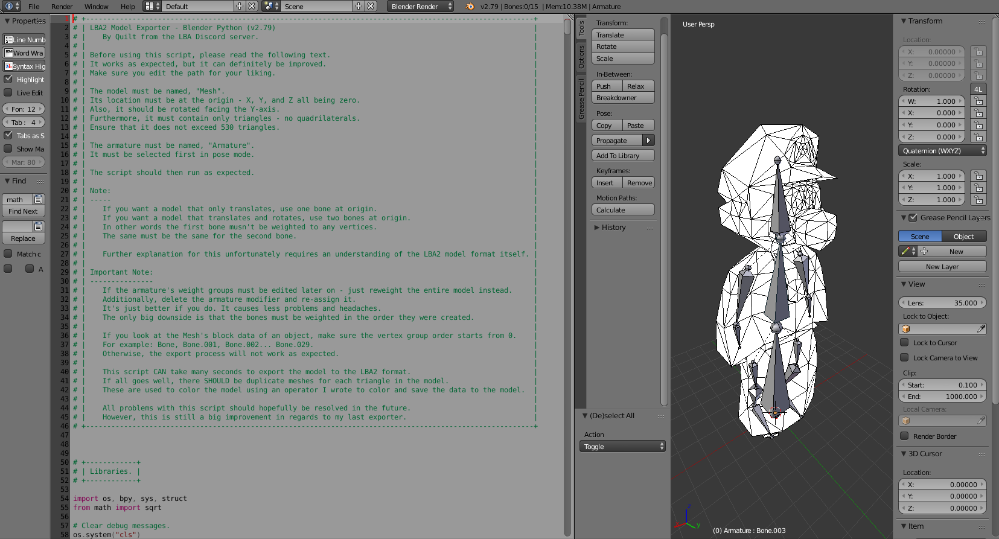
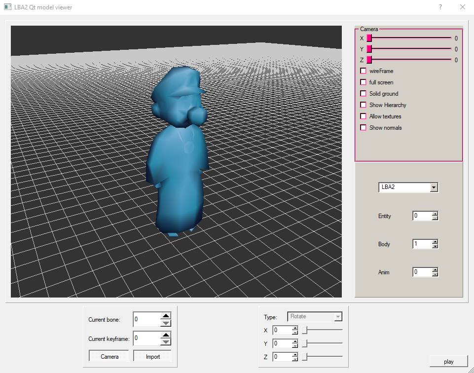
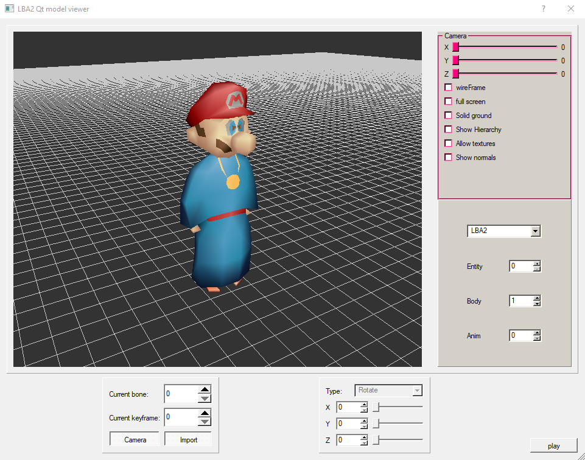

# LBA2 Blender to Model 2
This is a new program to export a Blender model to the LBA2 model format. This is also the first publicly released version of this Blender Python script and is still far from perfect. Though, it is almost completely rewritten from my pervious script. Unlike that one, this is mainly intended for rigged models.

Again, I owe a lot of credit to Xesf. Without his documentation on the LBA2 model format, none of this would have been possible. Here is the link to his notes on the LBA2 model format: http://lbafileinfo.kazekr.net/index.php?title=LBA2:3D_model.

Copied from my last readme: To use your model in Little Big Adventure 2 (Twinsen's Odyssey) game, use Zink's LBA Package Editor program from the https://www.magicball.net/ website. Here is the exact link: https://www.magicball.net/downloads/programs/development/lba_package_editor. Replace any entry that uses a model file, and build the HQR output to the same HQR file. You should see the model at that location in the game.

More importantly, you will want to make sure your models actually work in the game. The fastest way to do this is to use Yaz0r's LBA1 / LBA2 model viewer which can also be downloaded from the Magic Ball network - as seen above. Though, you will need a hex editor to replace the files in the "body" folder - or rename your model file to have the same name as one of the bodies from the folder. I usually like to replace "body002.ldc" with mine as the program can crash if you replace the first body and something is wrong with it. Anyway, here is the exact link to that program: https://www.magicball.net/downloads/programs/development/lba_model_viewer

Furthermore, my code has only been written and tested on Windows 10 with Blender 2.79b. If you plan to port it to other operating systems in other languages, please do - just be sure to let me know. I don't know much about licensing, but all permission to port is welcome.

I am more likely to update this version if it needs be as the previous version is very tedious and very un-user friendly. Chances are I will never return to that one.

There is an example model file I have included in the "Models" folder which should look something like this when opened in Blender 2.79. It is Twinsen with Mario 64's head:

Here is how the exported model looks in Yaz0r's old LBA1 / LBA2 model viewer:

And here is the same version of the above but with colors applied to it.

In the same "Models" folder I have included the final model containing the colors and is model-ready for LBA2.

Hope you enjoy.
